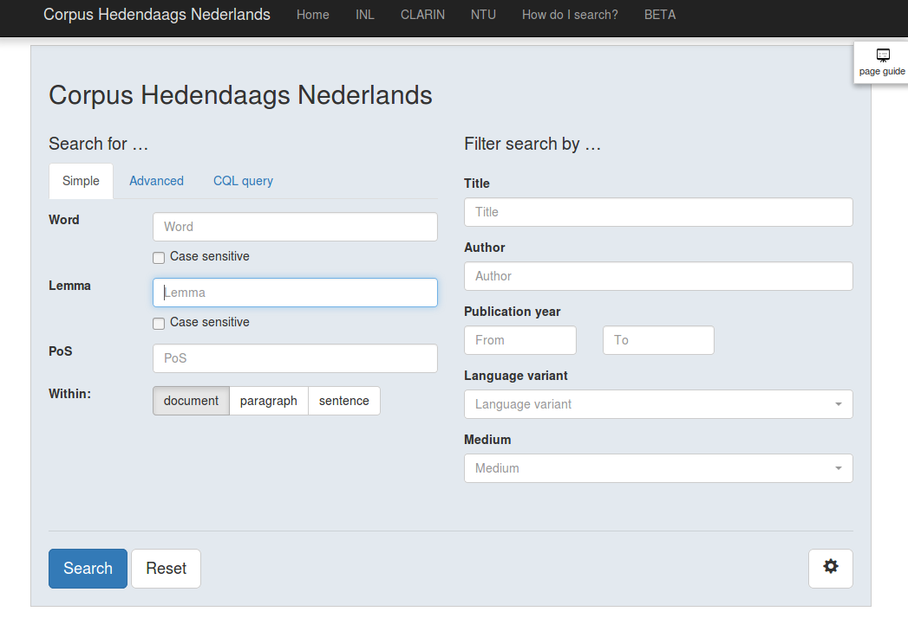

# Getting Started

There's [several examples online](/guide/#try-it-online) of what you can do with BlackLab.

But at some point, you're going to want to run it yourself so you can experiment with your own data.

Before you can search your data using BlackLab, you'll need to:

- Install BlackLab
- Prepare your data
- Index your data

Let's go over these one by one.

## Server or Core?

The web service, BlackLab Server, can be used from any programming language and offers a simple REST interface. The Java library offers the most flexibility, but it does mean you have to use a language that runs on the JVM (e.g. Java, Scala, Kotlin, etc.).

For now, this guide will focus on BlackLab Server. If you're interested in the Java library, see the [Developers](/development/) section.


## Install BlackLab Server

You will need a JVM version of 11 or higher to use the latest BlackLab versions. Also install Apache Tomcat 9.

Create an empty directory where you want to store your indexed corpora, for example `/data/blacklab-corpora`. Make sure this directory can be read by the user running Tomcat (making it world-readable ensures this). Now create a directory `/etc/blacklab` with a file named `blacklab-server.yaml`:

```yaml
---
configVersion: 2

# Where indexes can be found
# (list directories whose subdirectories are indexes, or directories containing a single index)
indexLocations:
- /data/blacklab-corpora
```

On the [GitHub releases page](https://github.com/INL/BlackLab/releases/), find the latest stable version (usually at the top) and download the attached file named blacklab-server-VERSION.war. Place this file in Tomcat's `webapps` directory. Tomcat should automatically recognize the file and initialize the application (usually, it will extract it to a subdirectory).

Now go to [https://localhost:8080/blacklab-server/](https://localhost:8080/blacklab-server/) (or substitute the hostname of the server you've installed it on if not running locally) and you should see an XML response from BlackLab.

*([learn more about BlackLab Server](../server/))*


## Prepare your data

In order to search your data using BlackLab, it needs to be in a supported format, and it needs to be indexed by BlackLab.


### Supported formats

BlackLab supports a number of input formats, but the most well-known are [TEI](http://www.tei-c.org/index.xml) (Text Encoding Initiative) and [FoLiA](http://proycon.github.io/folia/) (Format for Linguistic Annotation). These are both XML formats. If your data is not already in one of the supported formats, you need to convert it. (see the next section if you want to use a test dataset instead of your own)

::: warning PLEASE NOTE
BlackLab needs *tokenized* data files as input. That means the word boundaries have already been determined and BlackLab can just index each word as it parses the input file.

It is possible to configure BlackLab to perform the necessary tokenizing and tagging; see [Convert/Tag plugins](/server/#convert-tag-plugins).
:::

One way to convert your data is using our tool [OpenConvert](https://github.com/INL/OpenConvert), which can generate TEI or FoLiA from txt, doc(x) or html files, among others. After conversion, you can tag the files using a tool such as [Frog](http://ilk.uvt.nl/frog/).

A [web-based user interface](http://openconvert.clarin.inl.nl/) for converting and tagging (Dutch) input files is available. You will need a [CLARIN.eu account](https://user.clarin.eu/user) ([more information](https://www.clarin.eu/content/clarin-identity-provider)).


### Testing with the Brown corpus

If you can't use your own data yet, we've provided a [tokenized, annotated TEI version of the Brown corpus](https://github.com/INL/BlackLab/wiki/brownCorpus.lemmatized.xml.zip) for you to test with. 

::: tip Brown corpus
The [Brown corpus](http://en.wikipedia.org/wiki/Brown_Corpus "http://en.wikipedia.org/wiki/Brown_Corpus") is a corpus compiled in the 1960s by [Nelson Francis and Henry Kucera](http://archive.org/details/BrownCorpus) at Brown University. It is small by today's standard (500 documents, 1M words). It was converted to TEI format by [Lou Burnard](http://users.ox.ac.uk/~lou/). It is available from archive.org under the [CC-BY-NC 3.0](http://creativecommons.org/licenses/by-nc/3.0/) license, but we've created our own version which includes lemmata.<br/>(Please note that we didn't check the lemmatization, and it probably contains errors - useful for testing purposes only!)
:::


### Index the data

There's a commandline tool to create a corpus called `IndexTool`. To use it, also download the blacklab-core-VERSION.jar from the [GitHub releases page](https://github.com/INL/BlackLab/releases/) and extract it somewhere convenient.

From this directory, run the IndexTool without parameters for help information:

	java -cp "blacklab.jar:lib" nl.inl.blacklab.tools.IndexTool
 
(this assumes `blacklab.jar` and the `lib` subdirectory containing required libraries are located in the current directory; if not, prefix it with the correct directory)

(if you're on Windows, replace the classpath separator colon `:` with a semicolon `;`)

We want to create a new index, so we need to supply an index directory, input file(s) and an input format:

	java -cp "blacklab.jar:lib" nl.inl.blacklab.tools.IndexTool create INDEX_DIR INPUT_FILES FORMAT

If you specify a directory as the `INPUT_FILES`, it will be scanned recursively. You can also specify a file glob (such as \*.xml) or a single file. If you specify a .zip or .tar.gz file, BlackLab will automatically index its contents.

For example, if you have TEI data in `/data/input/my-tei-files/` and want to create an index at `/data/blacklab-corpora/my-corpus`, run the following command:

	java -cp "blacklab.jar:lib" nl.inl.blacklab.tools.IndexTool create /data/blacklab-corpora/my-corpus /data/input/my-tei-files/ tei

Your data is indexed and placed in a new BlackLab corpus in the `/data/blacklab-corpora/my-corpus` directory.

> Please note that if you're indexing very large files, you should [give java more than the default heap memory](https://docs.oracle.com/cd/E15523_01/web.1111/e13814/jvm_tuning.htm#PERFM161), using the `-Xmx` option. For really large files, and if you have the memory, you could use `-Xmx 6G`, for example.

See also:

- [Adding a new input format](how-to-configure-indexing.html) (if your format isn't supported yet and you don't want to convert)
- [Indexing in detail](indexing-with-blacklab.html)

### Testing your index

#### BlackLab Server

If your corpus was created as a subdirectory of the `indexLocation` you configured above (`/data/blacklab-corpora` in the above example), BlackLab Server should pick it up automatically. You can test this by going to http://localhost:8080/blacklab-server/my-corpus. If it worked, you should see metadata about your corpus.

#### Command line QueryTool

**TODO:** move to `/development/`

BlackLab Core includes a very basic command-based query tool useful for testing and debugging. To query the index you just created using this tool, type:

	java -cp "blacklab.jar:lib" nl.inl.blacklab.tools.QueryTool /data/blacklab-corpora/my-corpus

The query tool supports several query languages, but it will start in CorpusQL mode. A few hints:

- Enclose each word between double quotes: `"the" "egg"` searches for "the" followed by "egg"
- You can user regular expressions: `".*g"` searches for words ending with 'g'
- If you want to get more of a feel for what kinds of matches were found, try grouping by matched text using the command "group match". Then, if you want to view one of the groups, use `group *n*`.

Type "help" to see a list of commands.

See also:

- [Using the query tool](/development/query-tool.md)
- [Corpus Query Language](/guide/corpus-query-language.md)

## Corpus search application

BlackLab Frontend is our corpus search application. It is easy to install; see its ([GitHub page](https://github.com/INL/corpus-frontend/)) for instructions.

**TODO:** quick install info here.



## A simple script

If you want to access your corpus using a script, that easy as well.

Below is an example in Python. It performs a CQL query and shows matches in KWIC (keyword in context) format:

```python
import urllib.parse
import urllib.request
import json

def words(context):
	""" Convert word array to string. """
	return " ".join(context['word'])

def search(cqlQuery):
	""" Search and show hits. """
	url = "http://localhost:8080/blacklab-server/my-corpus/hits?patt=" + \
		urllib.parse.quote_plus(cqlQuery) + "&outputformat=json"
	f = urllib.request.urlopen(url)
	response = json.loads(f.read().decode('utf-8'))
	hits = response['hits']
	docs = response['docInfos']
	for hit in hits:
		# Show the document title and hit information
		doc = docs[hit['docPid']]
		print(words(hit['left']) + " [" + words(hit['match']) + "] " + \
			words(hit['right']) + " (" + doc['title'][0] + ")")

# "Main program"
search('[pos="a.*"] "fox"')
```

More examples can be found [here](../server/from-different-languages.md).
